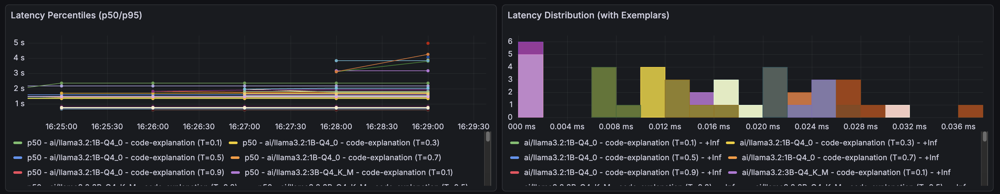
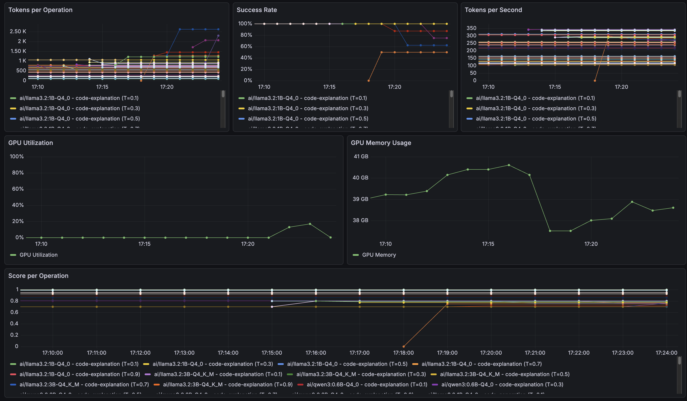

# 11-benchmarks

Contains an example of benchmarking multiple Small Language Models (SLMs) using Go's benchmarking framework, Docker Model Runner, OpenTelemetry, and the Grafana LGTM stack, using an Evaluator Agent pattern.

The goal is to find *the smallest model that won't completely fail you*.

## Libraries Involved

- `github.com/testcontainers/testcontainers-go`: [Testcontainers for Golang](https://github.com/testcontainers/testcontainers-go) is library for running Docker containers for integration tests.
- `github.com/testcontainers/testcontainers-go/modules/dockermodelrunner`: A module for running local language models using Testcontainers and the Docker Model Runner component of Docker Desktop.
- `github.com/testcontainers/testcontainers-go/modules/grafana-lgtm`: A module for running the complete Grafana observability stack (Loki, Grafana, Tempo, Mimir) using Testcontainers.
- `github.com/tmc/langchaingo`: A library for interacting with language models.
- `github.com/tmc/langchaingo/llms/openai`: A specific implementation of the language model interface for OpenAI.
- `go.opentelemetry.io/otel`: The OpenTelemetry SDK for Go, used for instrumentation.
- `go.opentelemetry.io/otel/exporters/otlp/otlpmetric/otlpmetrichttp`: OTLP exporter for metrics over HTTP.
- `go.opentelemetry.io/otel/exporters/otlp/otlptrace/otlptracehttp`: OTLP exporter for traces over HTTP.

## Benchmark Design: Full Factorial Experiments

This benchmark implements a **full factorial design** to systematically explore:
- **Models**: 4 local models + optional OpenAI GPT-5.1 (if `OPENAI_API_KEY` is set)
- **Test Cases**: 8 prompts:
  - 5 standard prompts (code-explanation, mathematical-operations, creative-writing, factual-question, code-generation)
  - 3 tool-assisted prompts (calculator-reasoning, code-validation, api-data-retrieval) - See [Tool Calling](#tool-calling-functionality) below
- **Temperatures**: 5 values (0.1, 0.3, 0.5, 0.7, 0.9)

**Total**: 160 scenarios (200 with OpenAI) to answer questions like:
- Which model performs best at low/high temperatures?
- How does quality vary across temperature settings?
- What's the optimal temperature for each model-task combination?
- Which models excel at tool calling and parameter extraction?

## Code Explanation

The code demonstrates how to benchmark multiple Small Language Models using Go's benchmarking framework combined with observability tools. The benchmarks run models through Docker Model Runner and collect comprehensive metrics using OpenTelemetry, visualizing them in Grafana.

### Main Components

- `bench_main_test.go`: Contains the `TestMain` function that sets up the test environment. It performs the following steps:
  1. Starts the [Grafana LGTM container](https://golang.testcontainers.org/modules/grafana-lgtm/) using Testcontainers. The image used is `grafana/otel-lgtm:0.11.18`.
  2. Initializes OpenTelemetry with OTLP exporters (traces and metrics) pointing to the LGTM stack.
  3. Creates a metrics collector for tracking latency, tokens, success rates, and GPU metrics.
  4. Starts the [Docker Model Runner container](https://golang.testcontainers.org/modules/dockermodelrunner/) for running local language models.
  5. Creates a Grafana dashboard immediately via the Grafana API, allowing real-time monitoring as metrics are collected during benchmark execution.
  6. Runs all benchmarks defined in `bench_llm_test.go`.
  7. Cleans up all resources on exit.

- `bench_llm_test.go`: Contains the `BenchmarkLLMs` function that benchmarks multiple models:
  1. Checks for `OPENAI_API_KEY` to optionally include GPT-5.1 (runs first if present).
  2. Defines 4 local models from [Docker's GenAI catalog](https://hub.docker.com/catalogs/gen-ai): Llama 3.2 1B/3B, Qwen3 0.6B, Llama 3.2 1B Instruct.
  3. Runs all test cases × temperature combinations for each model.
  4. Records latency, prompt evaluation time, tokens, success rate, and optional GPU metrics.
  5. Creates OpenTelemetry traces with exemplars for each request.
  6. Reports aggregate metrics (p50, p95, tokens/sec, etc.).

- `llmclient/llmclient.go`: Wraps LLM client with OpenTelemetry tracing and logging. Automatically detects OpenAI endpoints and handles authentication via `OPENAI_API_KEY`. Logs all model responses with prompts, tokens, and latency to Loki.

- `evaluator/evaluator.go`: Implements the Evaluator Agent pattern for quality assessment. Logs all evaluation results (question, answer, score, reasoning) to Loki for analysis.

- `otel_setup.go`: Initializes OpenTelemetry with OTLP exporters for traces, metrics, and logs.

- `metrics.go`: Defines histograms (latency, prompt eval time with exemplars) and gauges (p50/p95, success rate, tokens/sec, GPU metrics).

- `gpu.go`: Samples GPU metrics with auto-detection for NVIDIA (`nvidia-smi`) and Apple Silicon (`ioreg`). See [GPU Metrics](#gpu-metrics) section below for details.

- `grafana_dash.go`: Creates a Grafana dashboard titled "LLM Bench (DMR + Testcontainers)" with 21 panels:
  1. **Latency Percentiles (p50/p95)** - Overall response time metrics
  2. **Latency Histogram with Exemplars** - Response time distribution with drill-down to traces
  3. **Prompt Evaluation Time (p50/p95)** - Time to first token metrics
  4. **Prompt Eval Time Distribution with Exemplars** - Prompt processing patterns
  5. **Tokens per Operation** - Token usage and verbosity
  6. **Success Rate** - Model reliability metrics
  7. **Tokens per Second** - Generation throughput
  8. **GPU Utilization** (Optional) - Hardware efficiency
  9. **GPU Memory** (Optional) - Memory consumption
  10. **Evaluator Score** - Quality assessment with drill-down to Loki logs
  11. **Evaluator Pass Rate** - Quality pass rate with drill-down to Loki logs
  12-17. **Tool Calling Metrics** (NEW) - Only populated for tool-assisted test cases:
      - **Tool Call Latency** - Execution time histogram per tool
      - **Tool Calls per Operation** - Average calls per benchmark
      - **LLM-Tool Iterations** - Roundtrips between LLM and tools
      - **Tool Success Rate** - Tool execution success ratio
      - **Tool Parameter Accuracy** - Parameter extraction correctness (0.0-1.0)
      - **Tool Selection Accuracy** - Correct tool choice rate (0.0-1.0)
  18. **ns/op (Go Benchmark)** - Go benchmark framework metric

  The dashboard includes template variables for filtering by model, test case, and temperature. The dashboard uses a fixed UID (`llm-bench-dmr-tc`) to ensure it is **automatically updated** on each benchmark run without creating duplicates.

## Tool Calling Functionality

This benchmark now includes **tool calling** capabilities to test how well models can use external tools to solve complex, multi-step tasks. Three new tool-assisted test cases have been added:

### Available Tools

1. **Calculator Tool** (`tools/calculator.go`):
   - Operations: add, subtract, multiply, divide, power, sqrt, factorial
   - Tests multi-step arithmetic reasoning
   - Example: Calculate `(125 * 47) + (980 / 20) - 156`

2. **Python Code Executor** (`tools/code_executor.go`):
   - Executes Python code in isolated Docker container
   - Base image: `python:3.12-alpine`
   - Safety limits: 30s timeout, 128MB memory, no network access
   - Tests code generation and validation

3. **HTTP Client** (`tools/http_client.go`):
   - Generic HTTP GET/POST client
   - Tests API interaction and data retrieval
   - Example: Fetch repository information from GitHub API

### Tool-Assisted Test Cases

- **calculator-reasoning**: Model must break down complex arithmetic into multiple calculator tool calls, then synthesize the final answer
- **code-validation**: Model generates Python code for Fibonacci sequence, executes it via code executor tool, and validates output
- **api-data-retrieval**: Model uses HTTP client to fetch GitHub repository data and summarizes key details

### Tool Calling Observability

The implementation includes comprehensive observability for tool calling:

**OpenTelemetry Callback Spans** (`callbacks/otel_handler.go`):
- Traces tool execution: `langchaingo.tool.start`, `langchaingo.tool.end`
- Tracks LLM lifecycle: `langchaingo.llm.generate.start`, `langchaingo.llm.generate.end`
- Records tool names, inputs, outputs, duration in span attributes
- Creates parent-child span hierarchy visible in Grafana Tempo

**Tool Metrics** (6 new metrics):
- Tool call latency histogram: Execution time per tool
- Tool calls per operation: How many tools models invoke
- LLM-tool iterations: Back-and-forth roundtrips
- Tool success rate: Execution success ratio
- Tool parameter accuracy: Evaluator-assessed correctness (0.0-1.0)
- Tool selection accuracy: Did model choose the right tool? (0.0-1.0)

**Tool Parameter Evaluation**:
The evaluator agent (`evaluator/evaluator.go`) assesses not just response quality, but also tool calling accuracy:
- Parameter extraction: Did the model extract correct arguments?
- Tool selection: Did the model choose the appropriate tool?
- Call sequence: Are operations performed in logical order?

Evaluation criteria stored in `evaluator/testdata/evaluation/tool-parameter-extraction/` with system prompts and reference files for each test case.

### Model Compatibility

**Note**: Tool-assisted test cases require models that support function calling. Models without function calling support will:
- Continue to run the 5 standard test cases normally
- May fail or error on tool-assisted cases (errors are caught and logged)

The benchmark automatically routes test cases:
- Standard cases → `runSingleBenchmark()` (no tools)
- Tool-assisted cases → `runSingleBenchmarkWithTools()` (with tools)

## Running the Example

### ⚠️ Important: Evaluator Model Recommendation

**For accurate quality assessments, we strongly recommend using OpenAI GPT-4o-mini as the evaluator agent** (not just for benchmarking). The evaluator judges the quality of all SLM responses, so using a high-quality evaluator is critical for reliable results.

**Why use GPT-4o-mini as evaluator?**
- Ensures accurate assessment of SLM responses
- Better at following JSON formatting requirements
- More consistent and reliable evaluation scores
- Cost-effective for evaluation workloads

See the [Evaluator Agent Deep Dive](#evaluator-agent-deep-dive) section below for complete details on evaluator model selection.

### Apple Silicon (M1/M2/M3/M4) - Recommended

**With GPU metrics and OpenAI evaluator** (RECOMMENDED):
```sh
export OPENAI_API_KEY="your-api-key-here"
sudo go test -bench=. -benchtime=5x -timeout=30m
```

**With GPU metrics only** (requires sudo for utilization tracking):
```sh
sudo go test -bench=. -benchtime=5x -timeout=30m
```

**Why sudo?** Apple Silicon requires `powermetrics` for GPU utilization metrics. Without sudo, you'll only see GPU memory (not utilization). The benchmark works fine without sudo, but you'll get more complete GPU metrics with it.

**Why OPENAI_API_KEY?** Sets GPT-4o-mini as the evaluator agent for accurate quality assessments of all benchmarked models. Without it, a local SLM will be used as evaluator (less accurate).

### Other Platforms (Linux/Windows with NVIDIA)

**With OpenAI evaluator** (RECOMMENDED):
```sh
export OPENAI_API_KEY="your-api-key-here"
go test -bench=. -benchtime=5x -timeout=30m
```

**Basic usage** (local evaluator - less accurate):
```sh
go test -bench=. -benchtime=5x -timeout=30m
```

### What to Expect

- 5 iterations per benchmark, up to 30 min timeout (model downloads take time)
- **100 scenarios** (4 local models × 5 test cases × 5 temperatures)
- **125 scenarios** with OpenAI API key (adds GPT-5.1)
- Containers kept running after completion for dashboard exploration

The benchmark disables [Ryuk garbage collector](https://golang.testcontainers.org/features/garbage_collector/#ryuk) to keep containers running after completion for dashboard exploration.

**Console output** showing metrics:

```shell
BenchmarkLLMs/Pull/llama3.2-8                                  1         ...
BenchmarkLLMs/llama3.2/code-explanation/temp0.1-8              5         ... latency_p50_ms:250.00 latency_p95_ms:280.00 prompt_eval_p50_ms:45.00 prompt_eval_p95_ms:52.00 tokens_per_op:45.00 success_rate:1.00 score:0.85 tokens_per_sec:180.00
BenchmarkLLMs/llama3.2/code-explanation/temp0.3-8              5         ... latency_p50_ms:255.00 prompt_eval_p50_ms:46.00 ...
BenchmarkLLMs/llama3.2/code-explanation/temp0.5-8              5         ... latency_p50_ms:260.00 prompt_eval_p50_ms:47.00 ...
BenchmarkLLMs/llama3.2/code-explanation/temp0.7-8              5         ... latency_p50_ms:270.00 prompt_eval_p50_ms:48.00 ...
BenchmarkLLMs/llama3.2/code-explanation/temp0.9-8              5         ... latency_p50_ms:290.00 prompt_eval_p50_ms:50.00 ...
BenchmarkLLMs/llama3.2/mathematical-operations/temp0.1-8       5         ... latency_p50_ms:150.00 prompt_eval_p50_ms:30.00 ...
...
```

**Grafana URL** (printed at startup):
```shell
📊 Grafana Observability Stack Ready
=================================================
URL: http://localhost:xxxxx
Credentials: admin / admin
Dashboard will be created after benchmarks run
=================================================
```

Open in browser (`admin`/`admin`) to view real-time metrics, latency distributions, traces, and model comparisons.

### GPU Metrics

**Supported GPUs**:
- **NVIDIA**: Auto-detected via `nvidia-smi` (utilization % and memory MB)
- **Apple Silicon (M1/M2/M3/M4)**: Auto-detected via `powermetrics` and `ioreg`
  - **GPU Memory**: Tracks allocation via `ioreg` (works without sudo)
  - **GPU Utilization**: Tracks active residency via `powermetrics` (requires sudo)
  - **Recommended**: Run with `sudo go test ...` for complete metrics

**Container Limitation**: GPU detection fails in containerized environments (Docker, Claude Code CLI) because containers can't access host GPU tools. **Run directly on host** for GPU metrics.

**What you'll see on Apple Silicon**:
- **With sudo**: Both GPU memory spikes and utilization % during model inference
- **Without sudo**: Only GPU memory (utilization will show 0%)

## Logs and Observability

All evaluator responses and model outputs are automatically logged to the Grafana LGTM stack (Loki) for analysis and debugging.

### What's Logged

**Evaluator Agent Logs** (`evaluator/evaluator.go`):
- Test case name, question, answer, and evaluation result
- Response (yes/no/unsure), reasoning, and score
- Accessible via LogQL: `{service_name="llm-benchmark", instrumentation_scope_name="evaluator"}`

**Model Response Logs** (`llmclient/llmclient.go`):
- Test case name, model name, prompts, temperature
- Response content, token usage
- Latency and TTFT (Time To First Token) metrics
- Accessible via LogQL: `{service_name="llm-benchmark", instrumentation_scope_name="llmclient"}`

### Accessing Logs in Grafana

1. Open Grafana URL (shown in console output after starting benchmarks)
2. Navigate to **Explore** → Select **Loki** data source
3. Use LogQL queries to filter and analyze logs

**Common queries**:
```logql
# All evaluator logs
{service_name="llm-benchmark", instrumentation_scope_name="evaluator"}

# All model response logs
{service_name="llm-benchmark", instrumentation_scope_name="llmclient"}

# Filter by model name
{service_name="llm-benchmark", instrumentation_scope_name="llmclient"} |= "llama3.2"

# Filter by test case
{service_name="llm-benchmark"} |= "mathematical-operations"

# Low-scoring evaluations
{service_name="llm-benchmark", instrumentation_scope_name="evaluator"} |= `"score":0`

# View latency data
{service_name="llm-benchmark", instrumentation_scope_name="llmclient"} |= "latency_ms"
```

**Note**: Logs use OpenTelemetry Protocol (OTLP). In the LGTM stack, only `service_name` is indexed as a Loki label. To filter by scope (evaluator/llmclient) or other attributes, use parsed field filters:

```logql
# Filter by evaluator scope
{service_name="llm-benchmark"} | scope_name=`evaluator`

# Filter by test case
{service_name="llm-benchmark"} | scope_name=`evaluator` | test_case=`mathematical-operations`
```

Click on log lines in Grafana to view all attributes (model, tokens, scores, etc.), then click on attribute values to add them as filters.

### Panel-to-Logs Drill-Down

The **Evaluator Score** and **Evaluator Pass Rate** panels include data links that let you click on any data point to view the individual evaluation logs that contributed to that aggregated metric:

- Click on a data point in the panel
- Select "View Individual Evaluations" from the context menu
- Grafana Explore opens with logs filtered to that test case in a ±30-second window around the clicked point

**Important**: Each metric data point shows an **average score** across multiple benchmark iterations. When you drill down, you'll see multiple log entries (one per iteration) with individual scores (0.0, 0.5, or 1.0) and detailed reasoning from the evaluator LLM.

### Advanced Log Queries

**Filter by score range**:
```logql
# Perfect scores
{service_name="llm-benchmark"} | scope_name=`evaluator` |= `"score":1`

# Failed evaluations
{service_name="llm-benchmark"} | scope_name=`evaluator` |= `"score":0`
```

**Filter by response type**:
```logql
# Only "yes" evaluations
{service_name="llm-benchmark"} | scope_name=`evaluator` |= `"response":"yes"`

# "no" or "unsure"
{service_name="llm-benchmark"} | scope_name=`evaluator` |~ `"response":"(no|unsure)"`
```

**Find slow model responses**:
```logql
{service_name="llm-benchmark"} | scope_name=`llmclient` |= "latency_ms"
```

### Log Attributes Reference

**Evaluator Logs** (`scope_name="evaluator"`):
- `test_case`: Test case name
- `question`: The question (truncated to 100 chars)
- `answer`: The answer being evaluated (truncated to 200 chars)
- `provided_answer`: Evaluator's summary
- `response`: "yes", "no", or "unsure"
- `reason`: Evaluation explanation
- `score`: 0.0 (no), 0.5 (unsure), or 1.0 (yes)

**Model Response Logs** (`scope_name="llmclient"`):
- `test_case`: Test case name
- `model`: Model name/identifier
- `system_prompt`: System instruction (truncated to 100 chars)
- `user_prompt`: User input (truncated to 200 chars)
- `temperature`: Temperature parameter
- `response_content`: Model's output (truncated to 500 chars)
- `prompt_tokens`, `completion_tokens`, `total_tokens`: Token counts
- `latency_ms`: Total response time
- `ttft_ms`: Time To First Token

### Log Correlation

**Trace Correlation**: Each log contains a `trace_id`. Click on it to view the full request trace in Tempo.

**Metric Correlation**: Use the dashboard's time picker to align metrics with log queries and identify patterns.

## Understanding the Metrics

The benchmark collects and reports several key metrics to help you evaluate model performance.

For log-based analysis of individual evaluations and model responses, see [Logs and Observability](#logs-and-observability).

### Console Metrics

- **latency_p50_ms / latency_p95_ms**: Median and 95th percentile response time (ms)
- **prompt_eval_p50_ms / prompt_eval_p95_ms**: Time to first token (TTFT) - prompt processing time (ms)
- **tokens_per_op**: Average tokens per request (prompt + completion)
- **success_rate**: Percentage of successful requests (0.0-1.0)
- **score**: Quality score (0.0-1.0) based on response characteristics
- **tokens_per_sec**: Generation throughput

### Grafana Dashboard Panels

The dashboard **"LLM Bench (DMR + Testcontainers)"** includes 10 panels with template variables (model, case, temp) for filtering:

#### 1-2. Latency (Percentiles & Histogram with Exemplars)
- **p50/p95**: Median and worst-case response times
- **Histogram**: Distribution patterns; click exemplars to drill into traces
- Lower = faster; compare consistency (p95 vs p50 gap)

#### 3-4. Prompt Eval Time (Percentiles & Distribution with Exemplars)
- Time to first token (TTFT) - prompt processing before generation
- Critical for perceived responsiveness
- Click exemplars to investigate slow evaluations

#### 5. Tokens per Operation
- Average tokens per request (verbosity indicator)
- Use for cost estimation: tokens/request × requests/day × cost/token

#### 6. Success Rate
- Reliability: % of requests completed without errors (0-100%)
- Target: 95%+ for production
- Note: Measures reliability, not quality

#### 7. Tokens per Second
- Generation throughput
- Higher = faster; critical for real-time apps

#### 8-9. GPU Utilization & Memory (Optional)
- **Utilization**: 0-100% usage (near 100% = may need more GPUs)
- **Memory**: MB consumed (check model fits your GPU)
- Requires host execution (not containers); see [GPU Metrics](#gpu-metrics) section

#### 10. Evaluator Score & Pass Rate
- **Evaluator Score**: Average quality rating (0.0-1.0) from the LLM evaluator agent
- **Pass Rate**: Percentage of responses marked as "yes" by the evaluator
- Based on test-case-specific evaluation criteria (see [Evaluator Agent Deep Dive](#evaluator-agent-deep-dive))
- Customize by editing system prompts in `evaluator/testdata/evaluation/`
- Balance quality scores with speed and success rate

For a complete guide on interpreting these panels, see [How to Read This Dashboard](#how-to-read-this-dashboard).

### Dashboard Template Variables

Filter results by:
- **model**: Specific models (e.g., `ai/llama3.2:1B-Q4_0`) - use "All" for overview or multi-select for comparison
- **case**: Test case type (e.g., `code-explanation`, `mathematical-operations`) - focus on your use cases
- **temp**: Temperature (0.1-0.9) - lower = deterministic, higher = creative

**Tips**:
- Combine dimensions (model + case + temp) to drill down
- Fix two dimensions, vary one to isolate effects
- Variables affect all panels simultaneously

## How to Read This Dashboard

### Example 1: Latency Histogram with Exemplars



**What you're seeing**:
- **Histogram bars**: Distribution of response times across models/test cases
- **Colored dots (exemplars)**: Individual requests that fell into each bucket

**How to use it**:
- Identify slow buckets (right side of histogram)
- Look for patterns: Are certain models/temps consistently slower?
- Filter by a specific model and test case using template variables to understand variance within that configuration

### Example 2: Tokens/sec vs GPU Utilization



**What you're seeing**:
- **Top panel**: Token generation throughput (tokens/sec) per model
- **Bottom panel**: GPU utilization percentage during benchmark (requires sudo on Apple Silicon)

**How to interpret**:
- **High tokens/sec + High GPU util**: Model efficiently using GPU (ideal)
- **Low tokens/sec + High GPU util**: GPU-bound bottleneck (model is slow despite GPU usage)
- **High tokens/sec + Low GPU util**: Efficient model with GPU headroom (can run more models)
- **Low tokens/sec + Low GPU util**: Likely CPU-bound or other bottlenecks

**Use case**:
- Determine if you can run multiple models on the same GPU by checking utilization headroom
- Identify GPU vs CPU bottlenecks

**Note**: Run with `sudo` on Apple Silicon for utilization metrics (see [Running the Example](#running-the-example) section).

## Model Selection Guide

**Goal**: Find the smallest model that meets your requirements.

Use the [Grafana Dashboard Panels](#grafana-dashboard-panels) to compare models across different metrics.

### Selection Process

1. **Filter by use case** (e.g., `case="code-generation"`)
2. **Check Success Rate** → Eliminate models <95%
3. **Check Score** → Target >0.7 for quality
4. **Check Latency p95** → Must meet your SLA
5. **Check Tokens/sec** → Ensure adequate throughput
6. **Check GPU Memory** → Verify hardware fit
7. **Select smallest model** passing all criteria

### Example: Code Assistant

**Requirements**: p95<500ms, success>98%, score>0.75, GPU<4GB

**Results**:
- Qwen3 0.6B: Fast (p95=200ms) but low score (0.65) ❌
- Llama 3.2 1B: p95=350ms, score=0.80 ✅ **Winner**
- Llama 3.2 3B: p95=650ms, score=0.90 (too slow) ❌

### Cost Calculation

`Cost per request = (GPU cost/hour × utilization%) / requests per hour`

## Extending the Benchmark

### Customizing Models and Test Cases

Edit `bench_llm_test.go` to customize:

- **External API Models**: Edit `getModelsToTest()` - external models skip pull step and run first
- **Local Models**: Edit `localModels` slice (must be in [Docker's GenAI catalog](https://hub.docker.com/catalogs/gen-ai))
- **Temperatures**: Edit `temperatures` slice (line ~76)
- **Test Cases**: Edit `testCases` slice (line ~47)

For quality evaluation customization, see [Customizing Quality Evaluation](#customizing-quality-evaluation).

### Customizing Quality Evaluation

The benchmark uses an **Evaluator Agent pattern** (LLM-as-evaluator) for quality scoring. See [Evaluator Agent Deep Dive](#evaluator-agent-deep-dive) for complete details.

To customize evaluation:

1. **Edit existing evaluation criteria**: Modify system prompts in `evaluator/testdata/evaluation/{test-case}/system_prompt.txt`
2. **Add new test cases**: Create new folders with `system_prompt.txt` and `reference.txt` files (see [Adding Custom Test Cases](#adding-custom-test-cases))
3. **Use different evaluator models**: Set `OPENAI_API_KEY` for GPT-4o-mini (recommended) or modify `bench_main_test.go` to use other models

**Important**: Keep system prompts compact to avoid JSON truncation issues. Always instruct the evaluator to summarize, not copy full answers or code.

## Evaluator Agent Deep Dive

### Overview

The evaluator agent acts as an LLM judge, providing objective assessment of response quality based on specific criteria for each test case. This offers:

- **Automated Quality Assessment**: No manual review needed
- **Consistency**: Same criteria applied across all models
- **Detailed Feedback**: Understand why responses succeed or fail
- **Scoring**: Quantitative metrics (0.0-1.0) for comparison

### ⚠️ Evaluator Model Recommendation

**We strongly recommend using a high-quality LLM for the evaluator agent**, such as OpenAI's GPT-4o-mini, rather than smaller local models.

**Why Use a High-Quality Evaluator?**

The evaluator's job is to assess the correctness and quality of responses from the models being benchmarked (which may include small language models or SLMs). Using a high-quality evaluator ensures:

1. **Accurate Assessments**: High-quality models like GPT-4 have better reasoning capabilities
2. **Consistent JSON Generation**: Premium models are better at following structured output requirements
3. **Nuanced Evaluation**: Better understanding of edge cases and partial correctness
4. **Reduced False Positives/Negatives**: More accurate distinction between correct, incorrect, and ambiguous responses
5. **Reliable SLM Benchmarking**: When benchmarking small/local models, you want confidence that evaluation accuracy isn't a bottleneck

**Cost Consideration**: GPT-4o-mini is cost-effective for evaluation (much cheaper than GPT-4) while maintaining high accuracy. The added API cost is typically negligible compared to the value of accurate evaluation data.

**Local Evaluator Limitations**: While the system falls back to local models (e.g., `ai/llama3.2:3B-Q4_K_M`) when no API key is available, be aware that:
- Local SLMs may struggle with strict JSON formatting requirements
- Evaluation accuracy may be lower, especially for nuanced test cases
- You may see more evaluation errors or inconsistent scoring
- This can undermine the reliability of your benchmark results

### How It Works

The evaluator uses **langchaingo** to create an LLM-powered judge that:
- Receives the original question, the model's answer, and reference criteria
- Applies test-case-specific evaluation prompts (embedded at compile time via `go:embed`)
- Returns structured JSON with:
  - `response`: "yes" (correct), "no" (incorrect), or "unsure" (ambiguous)
  - `reason`: Explanation of the evaluation
  - `score`: Numeric score (1.0 for yes, 0.0 for no, 0.5 for unsure)

### Evaluation Criteria by Test Case

**Code Explanation**:
- Identifies Fibonacci implementation
- Explains recursive approach
- Mentions base cases
- Clarity and accuracy

**Mathematical Operations**:
- Correct result (5050 for sum 1-100)
- Proper calculation method
- Understanding of arithmetic series

**Creative Writing**:
- Contains Fibonacci-related joke
- Demonstrates humor/wit
- Coherent and complete
- References Fibonacci concepts

**Factual Question**:
- Mentions Toledo School of Translators
- References Arabic/Greek → Latin translations
- Notes 12th-13th century timeframe
- Explains cultural significance

**Code Generation**:
- Valid Go code
- Implements Fibonacci with recursion
- Correct base cases
- Proper recursive calls

### Adding Custom Test Cases

1. Create folder: `testdata/evaluation/{test-case-name}/`
2. Add `system_prompt.txt`:
```
You are an expert evaluator...

IMPORTANT: Respond ONLY with valid, compact JSON. Keep all fields concise (max 2-3 sentences each).

Required JSON format:
{
  "provided_answer": "brief summary of the answer (NOT the full text)",
  "response": "yes/no/unsure",
  "reason": "1-2 sentence explanation of your evaluation"
}

Evaluation criteria:
- Point 1
- Point 2

Response must be:
- "yes" if the answer meets criteria
- "no" if the answer fails criteria
- "unsure" if the answer is ambiguous

CRITICAL: Keep the JSON compact. Summarize answers briefly. Do NOT copy full text or code.
```

3. Add `reference.txt`: Expected correct answer or behavior description

4. Update `evaluator/evaluator.go`:
```go
//go:embed testdata/evaluation/your-test-case/system_prompt.txt
var yourTestCaseSystemPrompt string

//go:embed testdata/evaluation/your-test-case/reference.txt
var yourTestCaseReference string
```

5. Add to `GetCriteria()` in `evaluator/evaluator.go`:
```go
"your-test-case": {
    TestCaseName: "your-test-case",
    SystemPrompt: strings.TrimSpace(yourTestCaseSystemPrompt),
    Reference:    strings.TrimSpace(yourTestCaseReference),
},
```

### Evaluator Metrics

The evaluator adds these metrics to benchmark output:

- `eval_score`: Average evaluation score (0.0-1.0) across all iterations
- Individual result fields:
  - `EvalScore`: Numeric score for the response
  - `EvalResponse`: "yes", "no", or "unsure"
  - `EvalReason`: Detailed explanation

### Best Practices

1. **Use a high-quality evaluator model** (OpenAI GPT-4o-mini or GPT-4) for accurate evaluations - critical for reliable SLM benchmarking
2. Run multiple iterations (benchtime=5x or more) for statistical significance
3. Review `EvalReason` field to understand failure patterns and improve test criteria
4. Adjust evaluation criteria based on your specific requirements
5. Consider evaluator latency in overall benchmark time (evaluation adds overhead)
6. Monitor evaluation error rates - high error rates may indicate evaluator model issues
